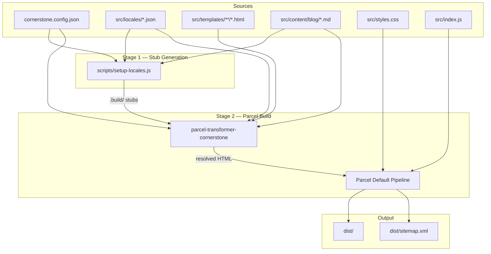
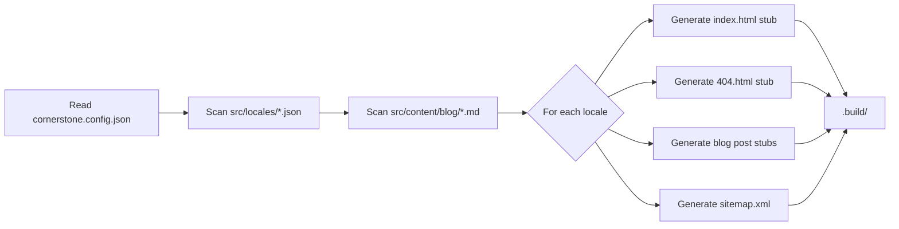
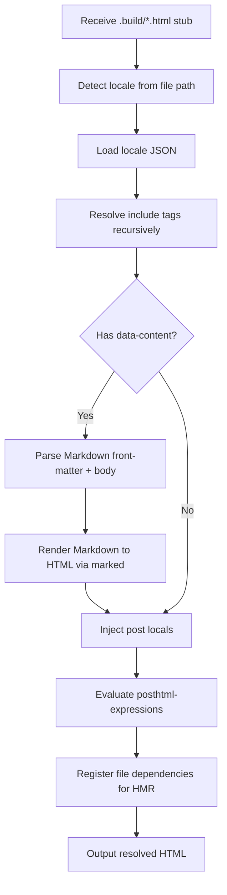
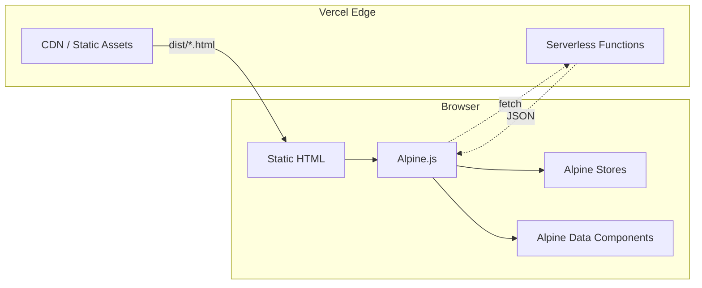
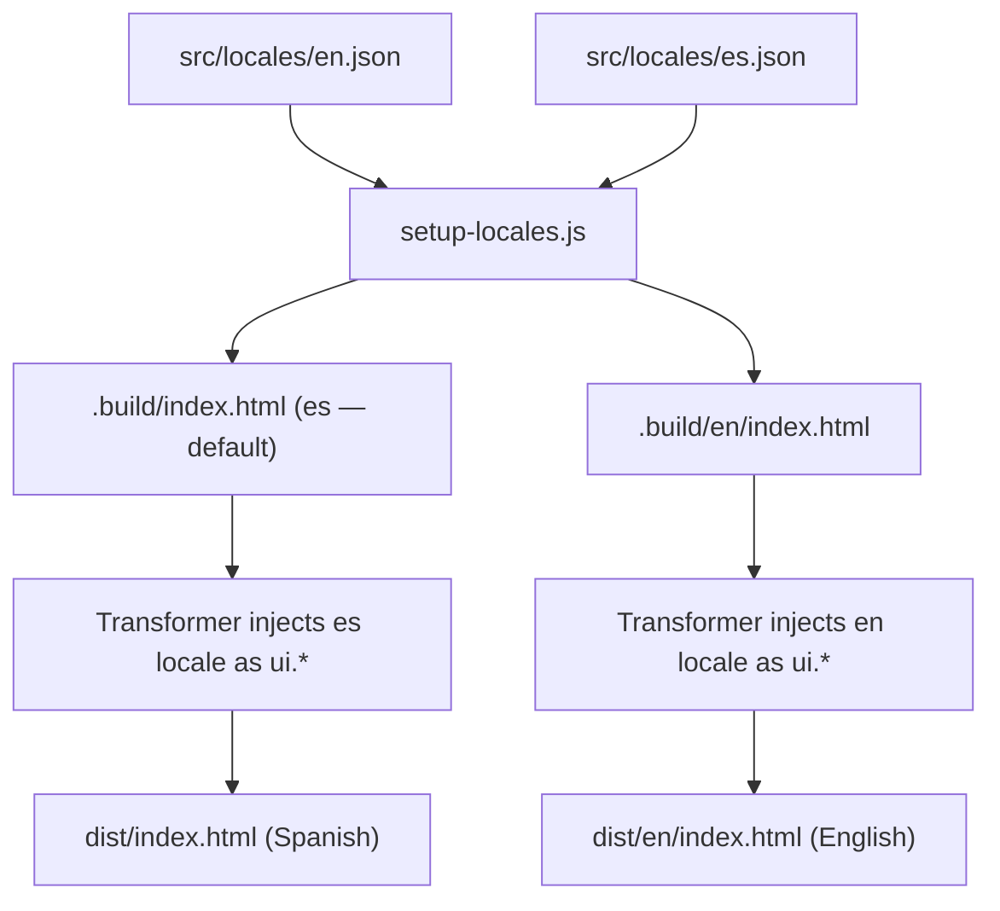
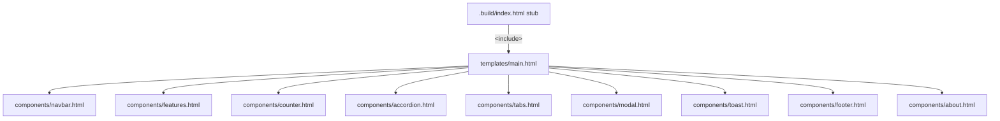
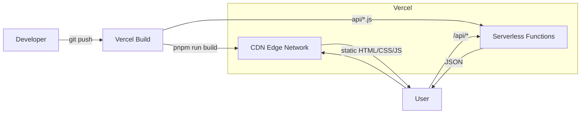

# Architecture

## Overview

Parcel Cornerstone is a **static-first site template** that combines Parcel 2,
a custom HTML transformer plugin, Alpine.js, and Vercel serverless functions.
The build pipeline generates fully static, localized HTML pages served from a
CDN, with lightweight client-side interactivity added by Alpine.js.

The key design principle is **build-time resolution**: i18n strings, component
includes, Markdown content, and template expressions are all evaluated during
the build — the browser receives plain HTML with zero templating overhead.

---

## High-Level Architecture

---

## Two-Stage Build Pipeline

### Stage 1 — Stub Generation (`setup-locales.js`)

Each stub is a minimal `<!DOCTYPE html>` shell containing:

- An `<include src="templates/...">` tag (not yet resolved)
- Asset references to `src/styles.css` and `src/index.js`
- A `data-content` attribute for blog posts (path to the `.md` file)
- Language-specific paths: default language → root, others → `/{lang}/`

### Stage 2 — Parcel Transform (`parcel-transformer-cornerstone`)

Every source file touched during transformation is registered with Parcel's
invalidation system, enabling automatic rebuilds and hot module replacement.

---

## Runtime Architecture

### Client-Side Layer

Alpine.js bootstraps in `src/index.js` and registers:

| Store / Data   | Purpose                                  |
| -------------- | ---------------------------------------- |
| `app` store    | Theme state (light / dark / system)      |
| `toasts` store | Toast notification queue                 |
| `counter` data | Simple counter component state           |
| `modal` data   | Modal open/close state                   |
| `toastItem`    | Per-toast display logic and icon mapping |

### Serverless API

Functions in `api/` are Vercel serverless endpoints (CommonJS) returning JSON.
They are independent of the static build and accessed via `fetch()` from the
client.

---

## Localization Flow

- The default language (from `cornerstone.config.json`) builds to the root path.
- Other languages build to `/{lang}/` subpaths.
- Missing locale keys emit build-time warnings.
- `hreflang` alternate links and a sitemap are generated for SEO.

---

## Component Composition

`<include src="...">` tags are resolved **recursively** at build time.
The transformer replaces each tag with the file's contents, supporting nested
includes. Every included file is tracked for HMR.

---

## Deployment Architecture

- **Static assets** are served from Vercel's CDN with immutable cache headers
  for hashed files (`max-age=31536000`).
- **Security headers** (CSP, X-Frame-Options, X-Content-Type-Options) are
  configured in `vercel.json`.
- **Brotli and Gzip compression** are enabled via Parcel compressor plugins.
- **Rewrites** handle SPA-like 404 fallbacks per locale.

---

## Technology Stack

| Layer         | Technology                              |
| ------------- | --------------------------------------- |
| Bundler       | Parcel 2                                |
| Transformer   | parcel-transformer-cornerstone (custom) |
| Templating    | posthtml-expressions (build-time)       |
| Markdown      | marked + front-matter                   |
| CSS           | Tailwind CSS v4 via PostCSS             |
| Interactivity | Alpine.js v3                            |
| API           | Vercel Serverless Functions             |
| Hosting       | Vercel (CDN + serverless)               |
